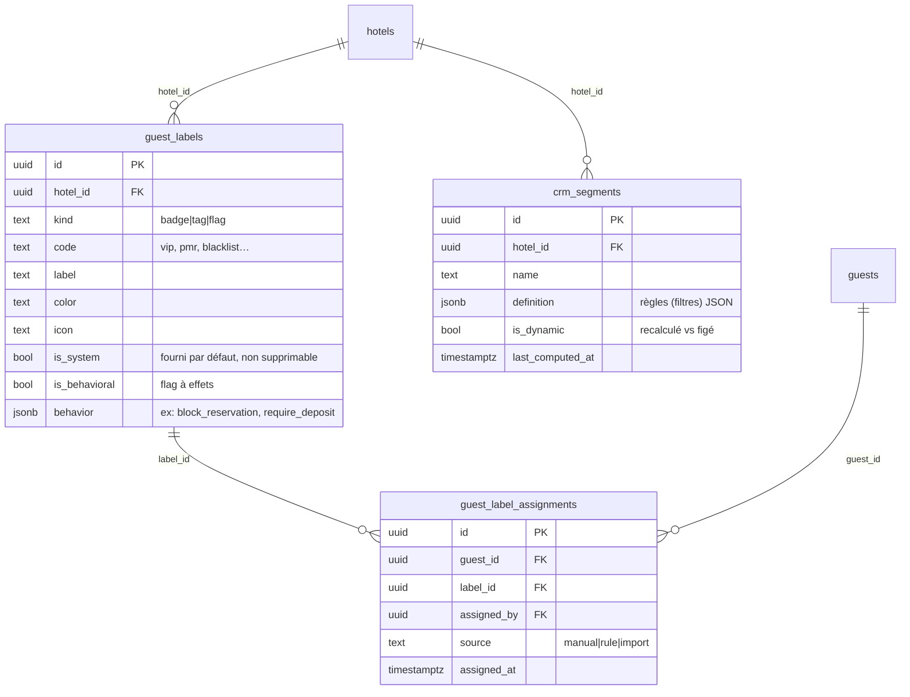

# Réflexion CRM — Badges vs Tags vs Flags vs Segments (préparation L5)

> Document de **conception/discussion** (pas de code). Objectif : sortir du
> simple tableau `guests.badges text[]` pour un système CRM riche, et proposer
> **une architecture unique** qui unifie les quatre notions sans les confondre.

---

## 1. Les quatre notions — définitions et différences

| Notion | Nature | Qui le pose | Cardinalité | Effet métier | Exemple |
|--------|--------|-------------|-------------|--------------|---------|
| **Badge** | Marqueur **visuel opérationnel**, vocabulaire **maîtrisé** par l'hôtel | Staff (manuel) ou règle | Plusieurs / client | Affichage (Flowday, planning, fiche) + parfois comportement | `VIP`, `PMR`, `Habitué`, `Attention` |
| **Tag** | Étiquette **libre**, à plat, créée à la volée | Staff | Plusieurs / client | Organisation / recherche, **aucun** effet automatique | `séminaire-2025`, `client-agence-X` |
| **Flag** | **État booléen comportemental** avec conséquences | Staff ou système | 1 par type | **Déclenche des règles** (blocage résa, alerte caution…) | `blacklist`, `litige`, `débiteur` |
| **Segment** | **Groupe dynamique** défini par des **critères** | Marketing/manager | Calculé, 0..n clients | Ciblage campagnes, analyses, automatisations | « VIP ayant séjourné > 3× en 2025 » |

**Lignes de partage clés :**
- Badge vs Tag : le **badge** appartient à un référentiel gouverné (couleur,
  icône, sémantique stable) ; le **tag** est libre et jetable.
- Flag vs Badge : le **flag** *fait quelque chose* (logique métier) ; un badge
  peut n'être qu'informatif. Tout flag peut s'afficher comme badge, l'inverse non.
- Segment vs les trois autres : un segment n'est **pas** stocké sur le client ;
  c'est une **requête** (statique = liste figée, ou dynamique = règle réévaluée).

État actuel (dette) : tout est aplati dans `guests.badges text[]` + colonnes
dérivées `vip`/`blacklisted`. Pas de couleurs/catégories par hôtel, pas de tags
libres, pas de segments, pas de gouvernance.

---

## 2. Architecture unique proposée

Principe : **un référentiel d'étiquettes typées** + **assignations** +
**segments calculés**. Les badges/tags/flags deviennent trois *kinds* d'un même
objet « label » ; les segments restent un objet distinct (car ce sont des
règles, pas des valeurs).

### Tables

1. **`guest_labels`** — référentiel par hôtel. `kind ∈ {badge, tag, flag}`.
   - `is_system = true` pour le jeu par défaut (VIP, PMR, blacklist…), non
     supprimable, mais personnalisable (couleur/label).
   - `is_behavioral` + `behavior jsonb` pour les flags à conséquences
     (ex. `{"block_new_reservation": true, "alert_on_checkin": true}`).
2. **`guest_label_assignments`** — table de liaison N-N + audit (`source`,
   `assigned_by`, `assigned_at`). Remplace à terme `guests.badges`.
3. **`crm_segments`** — définitions de segments. `definition jsonb` = arbre de
   critères (séjours, CA, labels, dates, canal…). `is_dynamic` : réévalué à la
   volée (vue/fonction) ou matérialisé périodiquement.

### Pourquoi *un* référentiel et pas trois tables ?

- Une seule UI de gestion (« Étiquettes »), filtrable par *kind*.
- Une seule table d'assignation → un seul chemin d'écriture, une seule timeline
  d'audit, une seule jointure pour « tous les labels d'un client ».
- Les différences (effet d'un flag, liberté d'un tag) sont portées par des
  **colonnes** (`kind`, `is_behavioral`, `behavior`), pas par des tables
  séparées → extensible sans nouvelle table.

### Compatibilité avec L0

Le trigger L0 `guests_sync_badges_flags` (badges ↔ vip/blacklisted) reste valable
pendant la transition. En L5, `guests.badges` sera alimenté/dérivé depuis
`guest_label_assignments` (vue ou trigger), puis déprécié comme `communication_logs`.

---

## 3. Recommandation

| Décision | Proposition |
|----------|-------------|
| Modèle | **Référentiel unique `guest_labels` (kind badge/tag/flag) + assignations + `crm_segments` séparé.** |
| Badges par défaut | Conservés en `is_system`, personnalisables (couleur/icône/label) par hôtel. |
| Tags | Mêmes mécanismes, `kind='tag'`, création libre, sans effet. |
| Flags | `kind='flag'`, `is_behavioral=true`, effets décrits en `behavior jsonb`, branchés sur la logique résa/caution. |
| Segments | Table dédiée à base de règles JSON, dynamiques par défaut, matérialisables pour les automatisations (L6). |
| Migration | `guests.badges` → backfillé vers assignations, gardé en lecture le temps de basculer les écrans (même stratégie que L2). |

**Question ouverte pour vous avant L5** : souhaitez-vous que les **segments**
pilotent directement les **automatisations** de communication (L6) — c.-à-d.
« tout client du segment X reçoit le scénario Y » ? Si oui, `crm_segments`
devra exposer une API de matérialisation stable consommée par le moteur L6.
