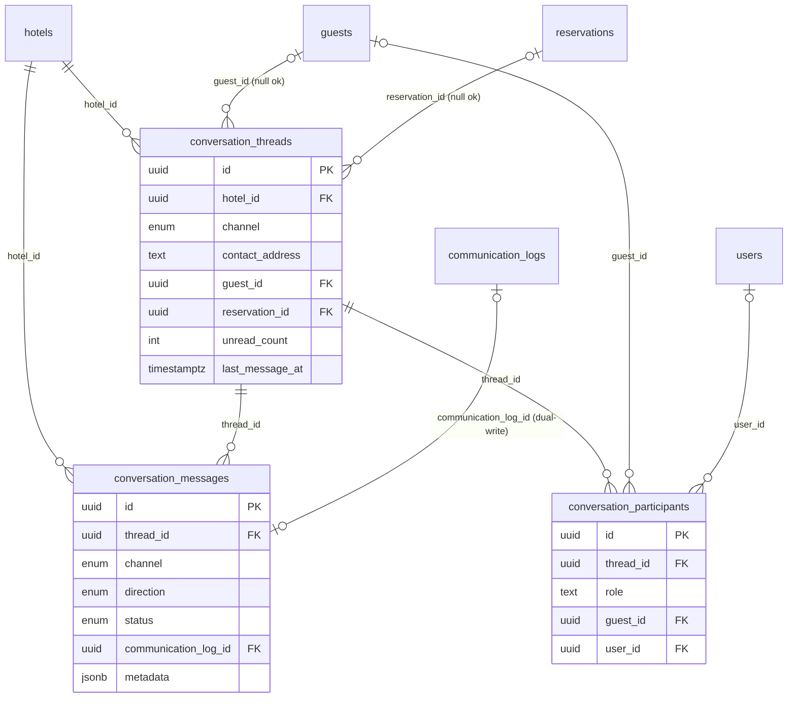
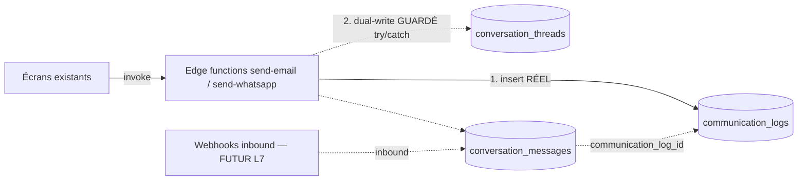

# L2 — Architecture Conversations (socle parallèle, sans casse)

> **Statut** : conception validée → implémentation socle.
> **Contrainte cardinale** : ne rien supprimer, ne pas remplacer `communication_logs`,
> ne pas modifier les écrans existants. La nouvelle architecture est construite
> **en parallèle** et alimentée par **dual-write** non bloquant. La bascule
> complète interviendra dans un lot ultérieur, écran par écran.

---

## 1. Schéma de base de données

Trois nouvelles tables + trois types ENUM natifs. Tout est rattaché à
`hotel_id` (isolation RLS) et, quand connu, à `reservation_id` et `guest_id`.

### Types ENUM (extensibles via `ALTER TYPE ... ADD VALUE`)

| Type | Valeurs | Usage |
|------|---------|-------|
| `conv_channel` | `email`, `sms`, `whatsapp`, `internal` | canal d'une conversation / d'un message (`internal` = futur chat Flowtym) |
| `conv_direction` | `inbound`, `outbound` | sens du message |
| `conv_message_status` | `queued`, `sent`, `delivered`, `read`, `failed` | cycle de vie d'un message (les états `delivered`/`read` seront alimentés par les webhooks futurs) |

### `conversation_threads` — une ligne par conversation

| Colonne | Type | Notes |
|---------|------|-------|
| `id` | uuid PK | |
| `hotel_id` | uuid NOT NULL → hotels | isolation |
| `channel` | `conv_channel` NOT NULL | |
| `contact_address` | text NOT NULL | email / numéro du client (clé naturelle de threading) |
| `guest_id` | uuid → guests (SET NULL) | nullable : un inbound inconnu peut ne pas matcher |
| `reservation_id` | uuid → reservations (SET NULL) | nullable |
| `subject` | text | objet email / sujet |
| `status` | text `open\|snoozed\|closed` | cycle de vie conversationnel |
| `assigned_to` | uuid → users (SET NULL) | futur : affectation à un agent |
| `last_message_at` | timestamptz | tri de la liste |
| `last_message_preview` | text | aperçu liste |
| `last_direction` | `conv_direction` | |
| `unread_count` | int DEFAULT 0 | inbound non lus côté staff |
| `external_id` | text | id de conversation côté provider (wa_id, root Message-ID…) |
| `created_at` / `updated_at` | timestamptz | |

**Clé naturelle / dédup** : `UNIQUE (hotel_id, channel, contact_address)`.

### `conversation_messages` — un message (in/out)

Reflète **volontairement** les colonnes de `communication_logs` pour permettre
un backfill 1-1 lors de la future migration.

| Colonne | Type | Notes |
|---------|------|-------|
| `id` | uuid PK | |
| `thread_id` | uuid NOT NULL → conversation_threads (CASCADE) | |
| `hotel_id` | uuid NOT NULL → hotels | dénormalisé (RLS + index) |
| `channel` | `conv_channel` NOT NULL | |
| `direction` | `conv_direction` NOT NULL | |
| `status` | `conv_message_status` NOT NULL DEFAULT `queued` | |
| `guest_id` / `reservation_id` | uuid (SET NULL) | |
| `from_address` / `to_address` | text | |
| `subject` / `body` | text | |
| `template_kind` | text | |
| `provider` / `provider_message_id` | text | |
| `error_message` | text | |
| `created_by` | uuid → users (SET NULL) | staff émetteur (null si inbound) |
| `communication_log_id` | uuid → communication_logs (SET NULL) | **traçabilité dual-write** |
| `metadata` | jsonb DEFAULT `{}` | payload provider brut, pièces jointes futures |
| `sent_at` / `delivered_at` / `read_at` | timestamptz | horodatage par état |
| `created_at` | timestamptz | |

### `conversation_participants` — acteurs d'une conversation

| Colonne | Type | Notes |
|---------|------|-------|
| `id` | uuid PK | |
| `thread_id` | uuid NOT NULL → conversation_threads (CASCADE) | |
| `hotel_id` | uuid NOT NULL → hotels | |
| `role` | text `guest\|staff\|system\|external` | |
| `guest_id` | uuid → guests (SET NULL) | si role=guest |
| `user_id` | uuid → users (SET NULL) | si role=staff |
| `display_name` | text | |
| `address` | text | email / téléphone du participant |
| `created_at` | timestamptz | |

**Dédup** : `UNIQUE (thread_id, role, COALESCE(guest_id,'…'), COALESCE(user_id,'…'), COALESCE(address,''))` (via index d'expression).

---

## 2. Diagramme des relations

**Coexistence** : `communication_logs` reste la source de vérité opérationnelle.
`conversation_messages` est peuplée **en plus** (dual-write) et conserve un
pointeur `communication_log_id` vers la ligne legacy correspondante.

---

## 3. Impact sur les Edge Functions

| Fonction | Changement L2 | Risque |
|----------|---------------|--------|
| `send-email` | Ajout d'un bloc **dual-write guardé** (`try/catch`) après le `insert` existant dans `communication_logs` : upsert du thread `(hotel_id, email, contact)`, insert du message `outbound` lié au `communication_log_id`, upsert participant guest. | **Nul** : tout échec (table absente, etc.) est avalé → le flux d'envoi existant n'est jamais impacté. |
| `send-whatsapp` | Idem (canal `whatsapp`). | **Nul** (même garde). |
| `send-dispute-email` | **Aucun** changement en L2. | — |
| Webhooks inbound | **Non implémentés** (L7). Le schéma (`direction='inbound'`, `delivered`/`read`, `external_id`, `metadata`) est prêt à les recevoir. | — |

Les fonctions continuent d'écrire `communication_logs` **en premier** et de
renvoyer exactement la même réponse. Le dual-write est strictement secondaire.

---

## 4. Impact sur les écrans existants

**Aucun en L2.** Les écrans (Flowday, Journal L1, fiche réservation, CRM)
continuent de lire `communication_logs` via `communicationService`. Le nouveau
`conversations.service.ts` (lecture timeline unifiée) est **livré mais non
branché** ; il sera consommé par le futur Journal unifié (L3) sans toucher au
reste. La page **Journal** actuelle reste identique.

---

## 5. Stratégie de migration sans casse

Approche **expand → dual-write → migrate → contract** :

1. **Expand (L2 — ce lot)** : créer tables + enums + RLS + RPC, démarrer le
   dual-write guardé. `communication_logs` reste la vérité. Réversible à 100 %.
2. **Backfill (lot ultérieur)** : script idempotent copiant l'historique
   `communication_logs` → `conversation_threads`/`messages` (regroupement par
   `hotel_id + channel + to_address`), en renseignant `communication_log_id`.
3. **Migrate lecture (L3+)** : basculer les écrans un par un vers
   `conversations.service`. À chaque écran, comparer avec la lecture legacy.
4. **Dual-write inversé (optionnel)** : une fois les écrans en lecture sur
   conversations, continuer d'écrire `communication_logs` pour compat jusqu'à
   validation complète.
5. **Contract (lot final)** : quand tous les écrans lisent conversations et que
   l'historique est vérifié, figer `communication_logs` en lecture seule (vue),
   puis le déprécier. **Jamais de DROP avant validation explicite.**

Garanties : chaque étape est additive ; aucune n'invalide la précédente ;
`communication_logs`, `communication_templates`, `communication_settings`
restent intacts tout du long.

---

## 6. Plan de rollback

| Niveau | Action de rollback | Effet |
|--------|--------------------|-------|
| **Dual-write** | Le bloc est déjà `try/catch` no-op : aucune action requise. Pour le désactiver explicitement, retirer le bloc dans les 2 edge functions et redéployer. | Les envois continuent normalement (legacy seul). |
| **Migration SQL** | `20260629_conversations_socle_rollback.sql` (fourni) : `DROP TABLE conversation_participants, conversation_messages, conversation_threads CASCADE; DROP TYPE conv_message_status, conv_direction, conv_channel; DROP FUNCTION conversation_get_or_create_thread, conversations_bump_thread.` | Retour à l'état pré-L2. **Aucune perte** sur les données legacy (tables conversation isolées). |
| **Frontend** | `conversations.service.ts` n'étant branché nulle part, sa simple présence est inerte. Le supprimer suffit. | Aucun impact. |

Le rollback est **sûr par construction** : les objets L2 ne sont référencés par
aucune table legacy (la FK `communication_log_id` pointe *depuis* conversations
*vers* logs, jamais l'inverse), donc leur suppression n'affecte pas l'existant.
